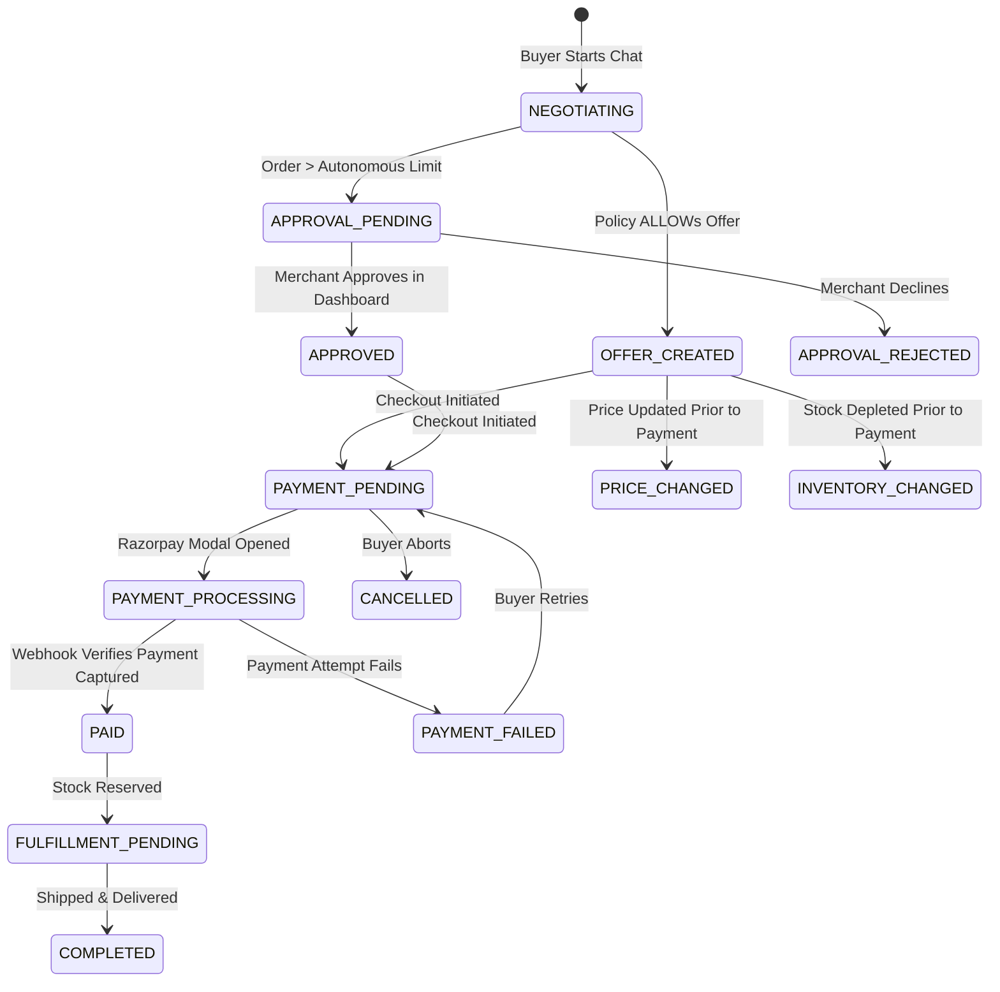

# Order State Machine

The **Order State Machine** tracks the commercial lifecycle of a negotiation and transaction from initiation to fulfillment.

Related: [[Index]], [[ADR-003 Decoupled Order State and Payment State]], [[Payment State Machine]], [[Phase 2 Database and Domain Model]]

---

## 🔄 State Lifecycle Diagram

---

## 🛡️ Failure & Recovery States
* **`PRICE_CHANGED`**: If the merchant updates product prices before payment is captured, the system pauses execution and forces the buyer to confirm the new price.
* **`INVENTORY_CHANGED`**: If another order buys the remaining inventory while a buyer is in checkout, prevents overselling.
* **`PAYMENT_FAILED`**: Captures Razorpay error codes without destroying the order draft, allowing instant retries.
